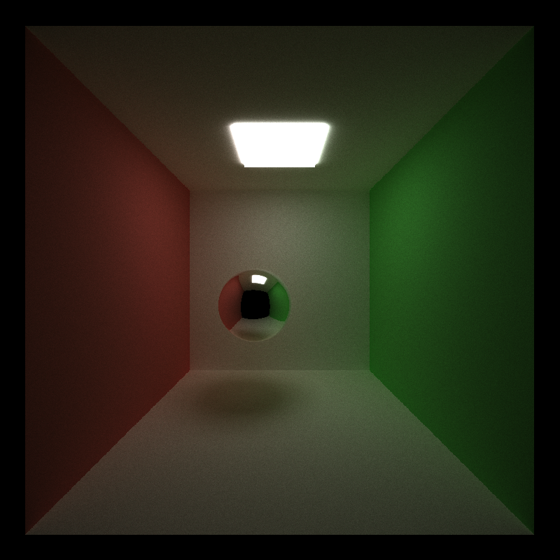
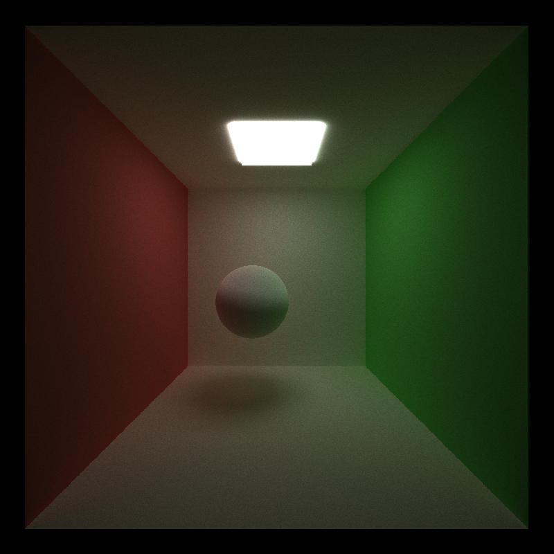
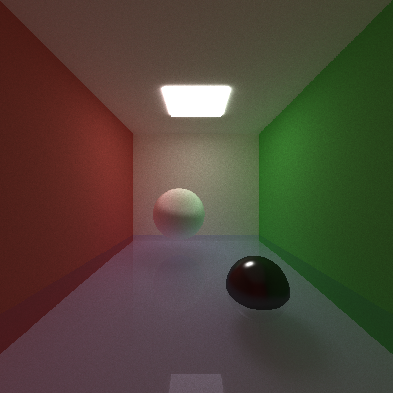

CUDA Path Tracer
================

**University of Pennsylvania, CIS 565: GPU Programming and Architecture, Project 3**

* Michael Willett
* Tested on: Windows 10, I5-4690k @ 3.50GHz 8.00GB, GTX 750-TI 2GB (Personal Computer)

## Contents
1. [Introduction](#intro)
2. [Basic Path Tracing](#part1)
3. [Additional Features](#part2)
4. [Development Process](#part3)
5. [Build Instructions](#appendix)

<a name="intro"/>
## Introduction: Scene Rendering
While many topics in computer graphics involve fast and effecient methods for improving real-time rendering,
the methods employed are often clever hacks on how to simulate natural looking scenes. Practice has shown, however,
that in order to generate the most realistic looking images, the developer must simulate the physical effects of how
light interacts with a scene. In the real world, light rays will emit from a source and bounce around and through the
objects in the environment, interacting with the colors of each object, until it finally hits the observer's eye. 
This project is aimed to implement a basic path tracer that replicates these physics. 

<a name="part1"/>
## Section 1: Path Tracing Algorithm
In the real world, what we see is a combination of an uncountable number of photons being emitted from every light source.
For computational efficiency, we choose to simulate the light rays in the reverse order; that is, we start by casting
simulated rays from the camera into each pixel of the scene. In a perfect world, the simulation of each photon would bounce
indefinitely until it hits a light source, however, since we do have limitations in the hardware, so we restrict the total number
of bounces. In this project, we assume each ray is allowed up to eight total bounces, with an additional direct lighting bounce
if enabled. 

In the initial implementation, materials followed three different light bouncing patterns: emissive light source, perfect reflection,
and perfect diffuse. The image below shows eight bounces with all the walls being perfectly diffuse (a ray can bounce in any random direction),
the sphere being perfectly reflective (the ray is perfectly reflected around the surface normal), and a single light source. The final image
generated after a total 5000 iterations was performed to addiquitely sample enough simulated photons to reflect a "real" image.

<a name="part2"/>
## Section 2: Additional Features

### Stream Compaction
The first attempted optimization was to use stream compaction to prevent 
 [Performance](#performance)

### First Bounce Cache

### Imperfect Specular Reflection

### Light Refraction with Fresnel Effects

### Anti-Aliasing

### Direct Lighting

<a name="performance"/>
### Performance Effects
Since most scenes need to be run for several thousand iterations to generate smooth results, some additional code optimizations were added to
reduce run time. The most significant improvement was to cache the first cast of rays from the camera and the calculated
intersections with materials. This reduces the first bounce pass to simply be a shader update and random generation of new rays. This resulted in 
a ~5% improvement in run speed (measured using std::chrono in microseconds).

<table class="tg">
  <tr>
    <th class="tg-baqh">Feature</th>
    <th class="tg-baqh">Time (ms)</th>
    <th class="tg-baqh">Change (%)</th>
  </tr>
  <tr>
    <td class="tg-amwm">Default</td>
    <td class="tg-baqh">57.9</td>
    <td class="tg-baqh">n/a</td>
  </tr>
  <tr>
    <td class="tg-amwm">Thrust Compaction</td>
    <td class="tg-baqh">119.6</td>
    <td class="tg-9ewa">+106.6</td>
  </tr>
  <tr>
    <td class="tg-amwm">Custom Compaction</td>
    <td class="tg-baqh">122.2</td>
    <td class="tg-9ewa">+53.8</td>
  </tr>
  <tr>
    <td class="tg-amwm">Material Sorting</td>
    <td class="tg-baqh">218.0</td>
    <td class="tg-9ewa">+131.0</td>
  </tr>
  <tr>
    <td class="tg-amwm">Cache First Bounce</td>
    <td class="tg-baqh">53.8</td>
    <td class="tg-baqh">-1.9</td>
  </tr>
  <tr>
    <td class="tg-amwm">Anti-aliasing</td>
    <td class="tg-baqh">57.9</td>
    <td class="tg-baqh">0.0</td>
  </tr>
  <tr>
    <td class="tg-amwm">Direct Lighting</td>
    <td class="tg-baqh">61.0</td>
    <td class="tg-baqh">+5.4</td>
  </tr>
</table>

<a name="part3"/>
## Section 3: Development Process

<a name="appendix"/>
## Appendix: Build Instructions
* `src/` contains the source code.

**CMake note:** Do not change any build settings or add any files to your
project directly (in Visual Studio, Nsight, etc.) Instead, edit the
`src/CMakeLists.txt` file. Any files you add must be added here. If you edit it,
just rebuild your VS/Nsight project to make it update itself.

**If you experience linker errors on build related to the compute capability during thrust calls, edit the project to include the CUDA
library 'cudadevrt.lib'**

#### Windows

1. In Git Bash, navigate to your cloned project directory.
2. Create a `build` directory: `mkdir build`
   * (This "out-of-source" build makes it easy to delete the `build` directory
     and try again if something goes wrong with the configuration.)
3. Navigate into that directory: `cd build`
4. Open the CMake GUI to configure the project:
   * `cmake-gui ..` or `"C:\Program Files (x86)\cmake\bin\cmake-gui.exe" ..`
     * Don't forget the `..` part!
   * Make sure that the "Source" directory is like
     `.../Project3-Path-Tracer`.
   * Click *Configure*.  Select your version of Visual Studio, Win64.
     (**NOTE:** you must use Win64, as we don't provide libraries for Win32.)
   * If you see an error like `CUDA_SDK_ROOT_DIR-NOTFOUND`,
     set `CUDA_SDK_ROOT_DIR` to your CUDA install path. This will be something
     like: `C:/Program Files/NVIDIA GPU Computing Toolkit/CUDA/v7.5`
   * Click *Generate*.
5. If generation was successful, there should now be a Visual Studio solution
   (`.sln`) file in the `build` directory that you just created. Open this.
   (from the command line: `explorer *.sln`)
6. Build. (Note that there are Debug and Release configuration options.)
7. Run. Make sure you run the `cis565_` target (not `ALL_BUILD`) by
   right-clicking it and selecting "Set as StartUp Project".
   * If you have switchable graphics (NVIDIA Optimus), you may need to force
     your program to run with only the NVIDIA card. In NVIDIA Control Panel,
     under "Manage 3D Settings," set "Multi-display/Mixed GPU acceleration"
     to "Single display performance mode".

#### OS X & Linux

It is recommended that you use Nsight.

1. Open Nsight. Set the workspace to the one *containing* your cloned repo.
2. *File->Import...->General->Existing Projects Into Workspace*.
   * Select the Project 0 repository as the *root directory*.
3. Select the *cis565-* project in the Project Explorer. From the *Project*
   menu, select *Build All*.
   * For later use, note that you can select various Debug and Release build
     configurations under *Project->Build Configurations->Set Active...*.
4. If you see an error like `CUDA_SDK_ROOT_DIR-NOTFOUND`:
   * In a terminal, navigate to the build directory, then run: `cmake-gui ..`
   * Set `CUDA_SDK_ROOT_DIR` to your CUDA install path.
     This will be something like: `/usr/local/cuda`
   * Click *Configure*, then *Generate*.
5. Right click and *Refresh* the project.
6. From the *Run* menu, *Run*. Select "Local C/C++ Application" and the
   `cis565_` binary.
