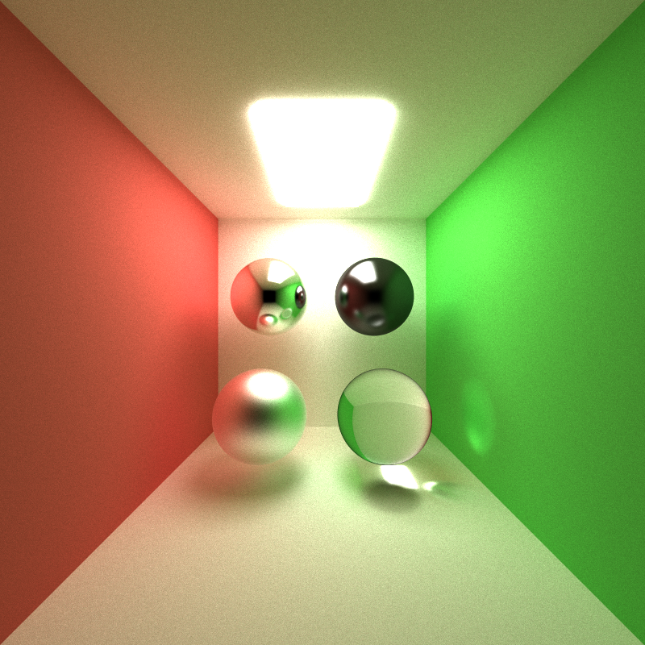
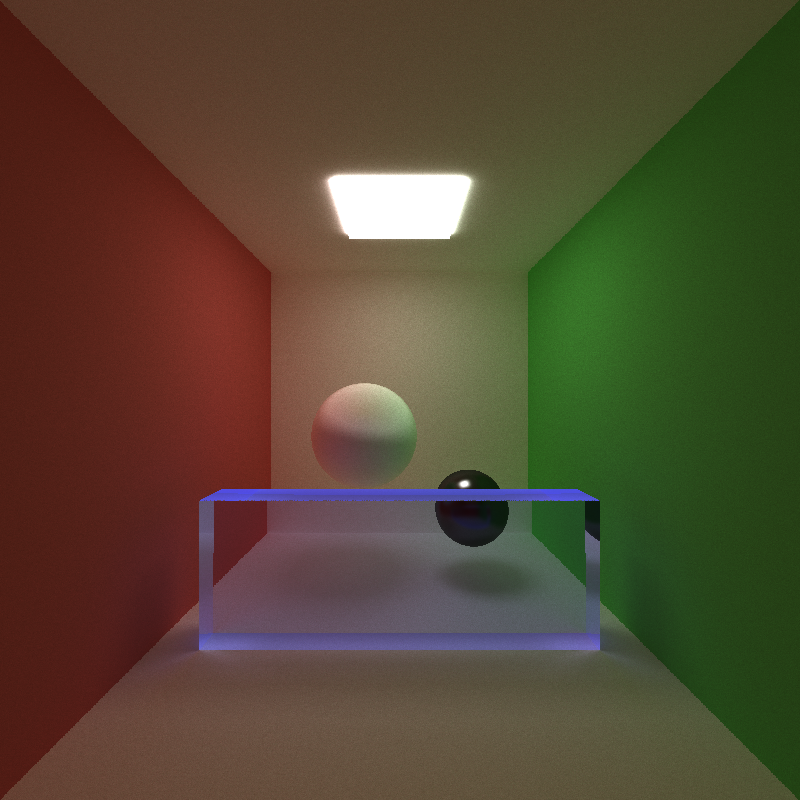
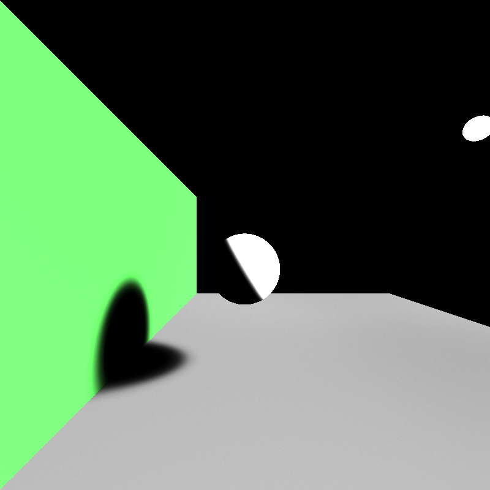
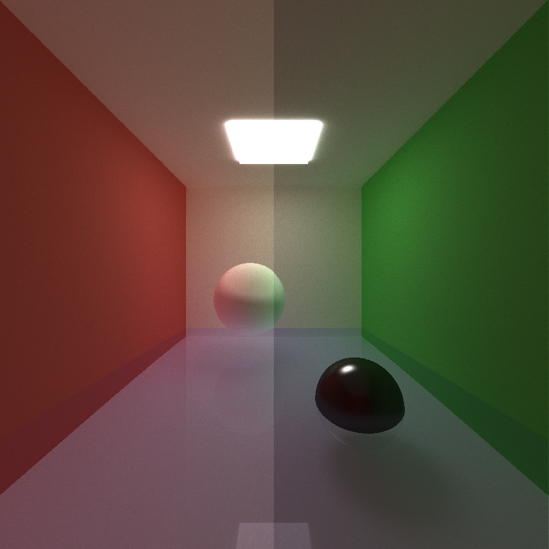
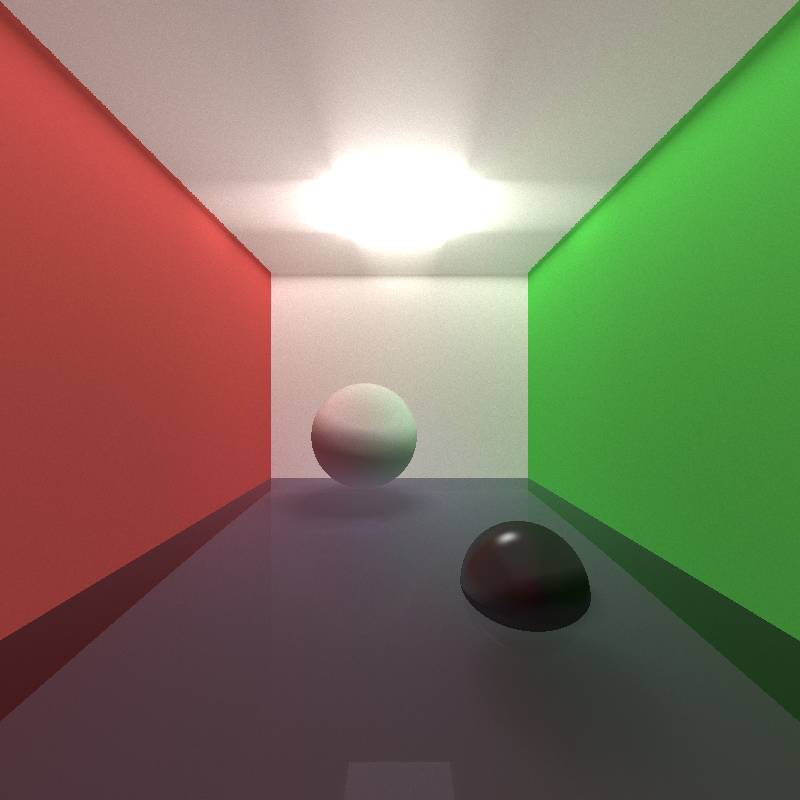

CUDA Path Tracer
================

**University of Pennsylvania, CIS 565: GPU Programming and Architecture, Project 3**

* Michael Willett
* Tested on: Windows 10, I5-4690k @ 3.50GHz 8.00GB, GTX 750-TI 2GB (Personal Computer)

## Contents
1. [Introduction](#intro)
2. [Basic Path Tracing](#part1)
3. [Additional Features](#part2)
4. [Performance](#performance)
5. [Build Instructions](#appendix)

<a name="intro"/>
## Introduction: Scene Rendering
While many topics in computer graphics involve fast and effecient methods for improving real-time rendering,
the methods employed are often clever hacks on how to simulate natural looking scenes. Practice has shown, however,
that in order to generate the most realistic looking images, the developer must simulate the physical effects of how
light interacts with a scene. In the real world, light rays will emit from a source and bounce around and through the
objects in the environment, interacting with the colors of each object, until it finally hits the observer's eye. 
This project is aimed to implement a basic path tracer that replicates these physics, resulting in the following image:

**Final image after 10,000 iterations. Spheres show perfect specular white,** 
**high specular black, imperfect specular gray, and clear refraction.**

<a name="part1"/>
## Section 1: Path Tracing Algorithm
In the real world, what we see is a combination of an uncountable number of photons being emitted from every light source.
For computational efficiency, we choose to simulate the light rays in the reverse order; that is, we start by casting
simulated rays from the camera into each pixel of the scene. In a perfect world, the simulation of each photon would bounce
indefinitely until it hits a light source, however, since we do have limitations in the hardware, so we restrict the total number
of bounces. In this project, we assume each ray is allowed up to eight total bounces, with an additional direct lighting bounce
if enabled. 

In the initial implementation, materials followed three different light bouncing patterns: emissive light source, perfect reflection,
and perfect diffuse. The image below shows eight bounces with all the walls being perfectly diffuse (a ray can bounce in any random direction),
the sphere being perfectly reflective (the ray is perfectly reflected around the surface normal), and a single light source. The final image
generated after a total 5000 iterations was performed to addiquitely sample enough simulated photons to reflect a "real" image. The basic
algorithm runs as follows:

1. Propogate new rays into the scene based off of last intersection.
2. Determine if the ray insersects with any objects, and if so select the closest intersection.
3. Update the color of the ray based on the material, and terminate the ray if the material is emissive.
4. Repeat steps 1-3 until the desired number of bounces has been reached.

**Basic depth-8 path tracing with only perfect diffuse and perfect specular materials**

<a name="part2"/>
## Section 2: Additional Features

### Stream Compaction
The first attempted optimization was to use stream compaction to prevent the intersection and shader kernels from operating on unnecessary rays.
Implementations were done both using the THRUST library as well a custom compaction kernel, however, significant bottlenecks were observered as
can be seen in the table [here](#performance). The leading cause of the performance loss is due to the substatial amounts of memory reads/writes, 
as simply removing the reording of the path array (but keeping index compaction) shows significant time improvements. It is possible that scenes 
with a higher likelihood of early ray termination might see some performance improvement due to fewer blocks, but not enough rays were exiting to 
be useful for this application. Additional effort was put into using shared memory for the custom implementation, however, during development this
method was failing for large arrays, and was never fully bench marked. Residual code can be found in the stream_compaction folder for future work.

### First Bounce Cache
One performance oriented modification that did yield noticeable improvements was simply to store the first ray projection from the camera and intersections. 
Theoretically this should have resulted in close to a 12% improvement, however, viewing the details of the performance analysis shows that ray generation 
overhead was minimal. This leaves the intersection test as the only room for improvement, and while it was the slowest running kernel in the code, the
shading kernel was a close second, so unfortunately runtime improvement was limited to 7%.

### Sorting Rays by Material
A final hypothesis for improving run time was to sort all rays by the material of the closest intersection. The idea is that kernel blocks would be
running the same calculations for successive rays, so there would be better kernel saturation per block. Unfortunately like the stream compaction results,
the overhead of rearranging the rays in the middle of the function resulted in significant overhead that was not compensated by the improvement to the
individual shader kernels.

### Imperfect Specular Reflection
Aside from runtime improvements, there were several modifications to the physics of the ray bounces to generate more realistic effects. The first was to include
imperfect specular reflection to perform some random dispersion of the light ray relative to the perfect reflection, but not full hemisphere sampling. The random
ray was calculated using two random angles: rotation around the reflected vector &theta;, and the angle between the perfect reflection and the random vector &phi;.
&theta; was generated as a uniform sampling from 0 to 2&pi; to reflect radially in any direction. The calculation for &phi; is slightly more complicated as it
determins how close to the perfect reflection the ray is scattered. Specifically, <i>&phi; = acos(x1/(n+1)) </i>, where n is the specular exponent of
the material, and x is randomly generated between 0 and 1. This results in random sampling in the hemisphere for n=0, and samples increasingly close to perfect
reflection as n grows larger. In the image below, we can see the specular sphere from the basic implementation was modified to have an imperfect specular reflection
with an exponent of 5.

**Imperfect specular sphere with specular exponent = 5**

### Light Refraction with Fresnel Effects
The second major physics improvement was to add light refraction for entering and exiting tranlucent materials. Most students who have taken basic a basic
physics class know that light will bend slightly when entering a new material based off of its index of refraction according to 
[Snell's Law](https://en.wikipedia.org/wiki/Snell%27s_law). Here, we can see a simulation of a simulation of a blue tinted window with internel reflection 
on the edges:

**Light refraction with internal reflection**

Taking refraction one step further, we know that transparent surfaces will also show some minor reflection of the scene in addition to the transparent effects.
This is known as a Fresnel effect, and in this implementation it can be appoximated simply by randomly sampling a ray bounce as either a reflective or refractive
bounce relative to a likelihood calculated using [Schlick's Approximation](https://en.wikipedia.org/wiki/Schlick%27s_approximation). Below, you can see side by side
the simulation of a pool with and without Fresnel effects causing reflections of the scene on the pool water.

**Pool of water with (right) and without (left) surface reflection**

### Stochastic Sampled Anti-Aliasing
One noticeable effect of always casting the rays to the center of each pixel being rendered is that the first collisions always start from the same coordinates,
resulting in similar computiations for what is not normally a discrete parameter. The easiest way to solve this is to simply add a random offset of the exact
ray direction in the initial ray cast into the scene within the boundary of one pixel. In this case, we again used a uniform distribution within each individual
pixel, resulting in significant edge smoothing without the need to post process the image after the path tracer completes. Below shows the before and after

**Anti-aliasing to noticeably smooth edge of black object**

### Direct Lighting
Another major limitation of the standard path tracing algorithm is that if a ray does not terminate at a light before the final depth is reached, it does not
accurately reflect the lighting conditions of the scene. The simplest approach to this is add a final step that terminates all rays by doing a final bounce to a
random point in a random emissive source in the scene. Without any additonal light bouncing, we can see the direct lighting alone can produce accurate shadows 
and does a good job at providing crude lighting to the scene:

**Direct lighting only**

Once added as a final step of the standard depth 8 path tracer, we can now get significantly improved lighting for the scene in the same number of iterations
show below (left is with direct lighting).

**Final pass to add direct lighting (Left: direct lighting on. Right: reflected light only.)**

Researching direct lighting online provided conflicting information on implementations. One of the ideas when computing direct lighting for a ray tracer instead
of a path tracer is to only compute direct lighting for the first bounce simillarly to the demo image, but then add that to the final path traced image. Unfortunately
this implementation resulted in significant blowout of the light sources and did not have the desired effect:

**Single pass direct lighting added directly to indirect render**

<a name="performance"/>
### Section 3: Performance Effects
All features discussed in Section 2 were analyzed relative to the baseline code for the simplest implementation. Unfortunately all but one attempt to improve performance by
better aligning rays to perform similar computations in the same blocks or to run fewer blocks ended up adding more overhead than they saved in resource. The only feature
that resulted in improvement in run speed was the first bounce cache, which resulted in a ~7% improvement. The shader kernel was still the second most time consuming process
after ray intersection calculations, so further improvements internal to that method could possibly improve GPU saturation. Unfortunately the method used for anti-aliasing
voids any time saved from caching first intersections, so if a smooth image is desired, we can not take advantage of that time save.

<table style="border-collapse:collapse;border-spacing:0;border-color:#999;width:400px;margin: auto;display: block;">
  <tr style="text-align:center;font-family:Arial, sans-serif;font-size:14px;font-weight:normal;padding:10px 5px;border-style:solid;border-width:0px;overflow:hidden;word-break:normal;border-color:#999;color:#fff;background-color:#26ADE4;">
    <th>Feature</th>
    <th>Time (ms)</th>
    <th>Change (%)</th>
  </tr>
  <tr style="text-align:center">
    <td>Default</td>
    <td>57.9</td>
    <td>n/a</td>
  </tr>
  <tr style="text-align:center">
    <td>Thrust Compaction</td>
    <td>119.6</td>
    <td style="color:red;">+106.6</td>
  </tr>
  <tr style="text-align:center">
    <td>Custom Compaction</td>
    <td>122.2</td>
    <td style="color:red;">+111.1</td>
  </tr>
  <tr style="text-align:center">
    <td>Material Sorting</td>
    <td>218.0</td>
    <td style="color:red;">+276.5</td>
  </tr>
  <tr style="text-align:center">
    <td>Cache First Bounce</td>
    <td>53.8</td>
    <td style="color:green;">-7.1</td>
  </tr>
  <tr style="text-align:center">
    <td>Anti-aliasing</td>
    <td>57.9</td>
    <td>0.0</td>
  </tr>
  <tr style="text-align:center">
    <td>Direct Lighting</td>
    <td>61.0</td>
    <td style="color:red;">+5.4</td>
  </tr>
</table>

*Tests measured using std::chrono in milliseconds*

<a name="appendix"/>
## Appendix: Build Instructions
* `src/` contains the source code.

**CMake note:** Do not change any build settings or add any files to your
project directly (in Visual Studio, Nsight, etc.) Instead, edit the
`src/CMakeLists.txt` file. Any files you add must be added here. If you edit it,
just rebuild your VS/Nsight project to make it update itself.

**If you experience linker errors on build related to the compute capability during thrust calls, edit the project to include the CUDA
library 'cudadevrt.lib'**

#### Windows

1. In Git Bash, navigate to your cloned project directory.
2. Create a `build` directory: `mkdir build`
   * (This "out-of-source" build makes it easy to delete the `build` directory
     and try again if something goes wrong with the configuration.)
3. Navigate into that directory: `cd build`
4. Open the CMake GUI to configure the project:
   * `cmake-gui ..` or `"C:\Program Files (x86)\cmake\bin\cmake-gui.exe" ..`
     * Don't forget the `..` part!
   * Make sure that the "Source" directory is like
     `.../Project3-Path-Tracer`.
   * Click *Configure*.  Select your version of Visual Studio, Win64.
     (**NOTE:** you must use Win64, as we don't provide libraries for Win32.)
   * If you see an error like `CUDA_SDK_ROOT_DIR-NOTFOUND`,
     set `CUDA_SDK_ROOT_DIR` to your CUDA install path. This will be something
     like: `C:/Program Files/NVIDIA GPU Computing Toolkit/CUDA/v7.5`
   * Click *Generate*.
5. If generation was successful, there should now be a Visual Studio solution
   (`.sln`) file in the `build` directory that you just created. Open this.
   (from the command line: `explorer *.sln`)
6. Build. (Note that there are Debug and Release configuration options.)
7. Run. Make sure you run the `cis565_` target (not `ALL_BUILD`) by
   right-clicking it and selecting "Set as StartUp Project".
   * If you have switchable graphics (NVIDIA Optimus), you may need to force
     your program to run with only the NVIDIA card. In NVIDIA Control Panel,
     under "Manage 3D Settings," set "Multi-display/Mixed GPU acceleration"
     to "Single display performance mode".

#### OS X & Linux

It is recommended that you use Nsight.

1. Open Nsight. Set the workspace to the one *containing* your cloned repo.
2. *File->Import...->General->Existing Projects Into Workspace*.
   * Select the Project 0 repository as the *root directory*.
3. Select the *cis565-* project in the Project Explorer. From the *Project*
   menu, select *Build All*.
   * For later use, note that you can select various Debug and Release build
     configurations under *Project->Build Configurations->Set Active...*.
4. If you see an error like `CUDA_SDK_ROOT_DIR-NOTFOUND`:
   * In a terminal, navigate to the build directory, then run: `cmake-gui ..`
   * Set `CUDA_SDK_ROOT_DIR` to your CUDA install path.
     This will be something like: `/usr/local/cuda`
   * Click *Configure*, then *Generate*.
5. Right click and *Refresh* the project.
6. From the *Run* menu, *Run*. Select "Local C/C++ Application" and the
   `cis565_` binary.
